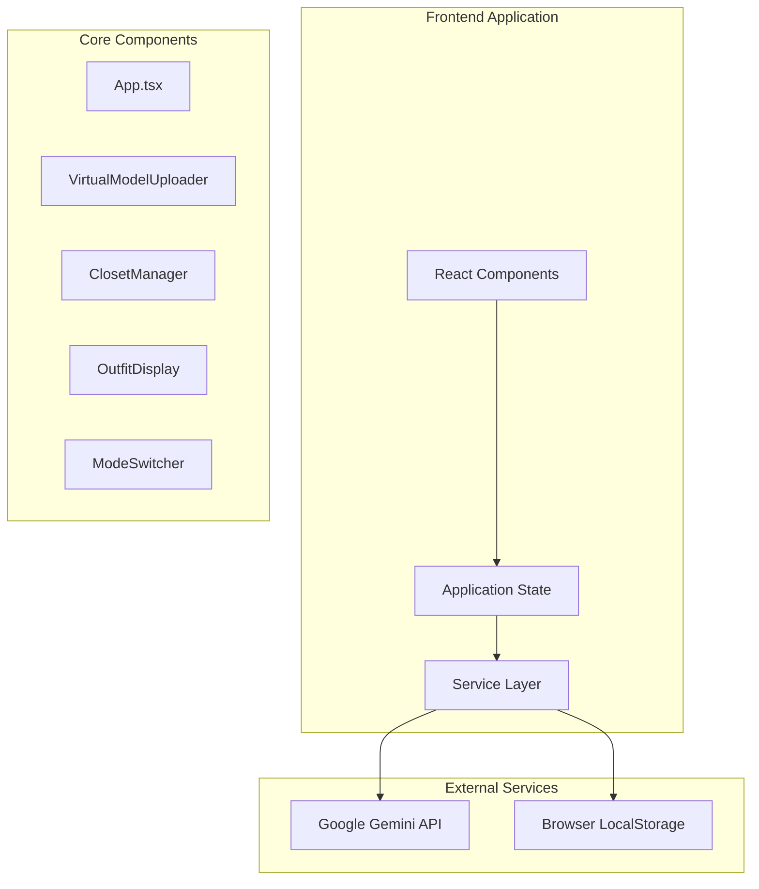

# Design Document

## Overview

The AI Virtual Wardrobe is a React-based web application that integrates with Google Gemini AI services to provide intelligent fashion recommendations and virtual try-on capabilities. The system follows a component-based architecture with clear separation of concerns between UI components, business logic, and external service integrations.

The application leverages modern web technologies including React 19, TypeScript, and Vite for optimal development experience and performance. The design emphasizes user experience through responsive layouts, intuitive interactions, and comprehensive error handling.

## Architecture

### High-Level Architecture



### Component Architecture

The application follows a hierarchical component structure with the main App component orchestrating state management and coordinating between specialized feature components:

- **App Component**: Central state management, mode switching, and component coordination
- **VirtualModelUploader**: Handles user photo upload and validation
- **ClosetManager**: Manages digital wardrobe, AI recommendations, and clothing generation
- **OutfitDisplay**: Visualizes try-on results and handles image generation
- **ModeSwitcher**: Provides interface for switching between basic and advanced modes

### State Management Strategy

The application uses React's built-in state management with hooks, avoiding external state management libraries for simplicity. State is centralized in the App component and passed down through props, ensuring predictable data flow and easy debugging.

## Components and Interfaces

### Core Data Models

```typescript
// Primary data structures
export type ClothingType = 'TOP' | 'BOTTOM';

export interface ClothingItem {
  id: number;
  type: ClothingType;
  description: string;
  imageUrl: string; // Base64 encoded data URL
}

export interface StyleRecommendation {
  styleName: string;
  description: string;
  topId?: number;
  bottomId?: number;
}

// Internal state interfaces
interface UserModel {
  base64: string;
  mimeType: string;
}

interface AppState {
  appMode: 'basic' | 'advanced';
  userModel: UserModel | null;
  closet: ClothingItem[];
  recommendations: StyleRecommendation[];
  selectedTop: ClothingItem | null;
  selectedBottom: ClothingItem | null;
  generatedOutfitImage: string | null;
  generatedOutfitText: string | null;
  // Loading and error states
  isLoading: boolean;
  isRecommending: boolean;
  error: string | null;
  recommendationError: string | null;
}
```

### Component Interfaces

#### VirtualModelUploader Component
```typescript
interface VirtualModelUploaderProps {
  title: string;
  onModelUpload: (base64: string, mimeType: string) => void;
}
```

**Responsibilities:**
- File upload handling with drag-and-drop support
- Image validation (format, size, dimensions)
- Base64 conversion and data preparation
- User feedback for upload status

**Design Decisions:**
- Uses FileReader API for client-side image processing
- Implements drag-and-drop for enhanced UX
- Validates file types and sizes before processing
- Provides immediate visual feedback during upload

#### ClosetManager Component
```typescript
interface ClosetManagerProps {
  title: string;
  closet: ClothingItem[];
  recommendations: StyleRecommendation[];
  onAddItems: (items: Omit<ClothingItem, 'id'>[]) => void;
  onGetRecommendations: () => void;
  onSelectRecommendation: (recommendation: StyleRecommendation) => void;
  isRecommending: boolean;
  error: string | null;
  selectedTopId?: number | null;
  selectedBottomId?: number | null;
}
```

**Responsibilities:**
- Digital closet visualization and management
- Multi-file upload with staging area
- AI-powered clothing generation interface
- Style recommendation display and selection
- Item selection visual feedback

**Design Decisions:**
- Implements staged upload process for better UX
- Provides both manual upload and AI generation options
- Uses grid layout for optimal space utilization
- Includes visual indicators for selected items

#### OutfitDisplay Component
```typescript
interface OutfitDisplayProps {
  title: string;
  userModelImage: string | null;
  generatedOutfitImage: string | null;
  generatedOutfitText: string | null;
  onGenerate: () => void;
  isLoading: boolean;
  error: string | null;
  isActionable: boolean;
}
```

**Responsibilities:**
- Side-by-side comparison of original and generated images
- Loading state management during AI processing
- Error display and user guidance
- Download functionality for generated images
- Responsive image display with proper aspect ratios

**Design Decisions:**
- Uses aspect-ratio containers for consistent image display
- Implements download functionality using blob URLs
- Provides comprehensive loading and error states
- Adapts interface based on current mode

### Service Layer Design

#### GeminiService Interface
```typescript
// Core service functions
export async function generateOutfit(
  base64ImageData: string, 
  mimeType: string, 
  prompt: string,
  topImageUrl: string | null,
  bottomImageUrl: string | null
): Promise<{ imageBase64: string | null; text: string | null }>;

export async function generateAndRecommendOutfit(
  base64ImageData: string, 
  mimeType: string
): Promise<{ imageBase64: string | null; text: string | null }>;

export async function getStyleRecommendations(
  closet: ClothingItem[]
): Promise<StyleRecommendation[]>;

export async function generateClothingItem(
  style: string, 
  color: string, 
  type: ClothingType, 
  customDescription: string
): Promise<string>;
```

**Design Decisions:**
- Centralizes all AI service interactions in a single module
- Implements consistent error handling across all API calls
- Uses structured prompts for reliable AI responses
- Handles both image and text responses from Gemini API
- Implements seasonal awareness for outfit recommendations

## Data Models

### Image Data Handling

The application handles images in multiple formats throughout the processing pipeline:

1. **File Upload**: Raw File objects from user input
2. **Storage Format**: Base64-encoded data URLs for localStorage persistence
3. **API Format**: Base64 strings with MIME type metadata for Gemini API
4. **Display Format**: Data URLs for HTML img elements

### State Persistence Strategy

```typescript
// LocalStorage schema
interface StoredCloset {
  version: string;
  items: ClothingItem[];
  lastModified: number;
}
```

**Design Decisions:**
- Uses versioned storage schema for future migration support
- Implements graceful degradation when localStorage is unavailable
- Includes timestamp for potential sync features
- Handles storage quota exceeded scenarios

### AI Integration Patterns

#### Prompt Engineering Strategy
The system uses structured prompts designed for consistent AI responses:

- **Virtual Try-On Prompts**: Include specific instructions for maintaining facial features and pose
- **Style Recommendation Prompts**: Use JSON schema enforcement for structured responses
- **Clothing Generation Prompts**: Specify studio photography requirements for consistent quality
- **Seasonal Awareness**: Incorporate current season data for contextually appropriate recommendations

#### Response Processing
```typescript
interface AIResponse {
  imageBase64: string | null;
  text: string | null;
}
```

All AI interactions follow a consistent response pattern that handles both successful generations and failure cases gracefully.

## Error Handling

### Error Classification and Handling Strategy

#### Client-Side Errors
- **File Validation Errors**: Size, format, and dimension validation with user-friendly messages
- **Storage Errors**: localStorage quota and availability issues with fallback behavior
- **State Errors**: Invalid state transitions with automatic recovery

#### API Errors
- **Network Errors**: Connection timeouts and retry logic with exponential backoff
- **Authentication Errors**: API key validation and user guidance
- **Rate Limiting**: Graceful handling of API quotas with user notification
- **Content Policy Violations**: Clear messaging when AI refuses to generate content

#### Error Recovery Mechanisms
```typescript
// Error boundary pattern for component-level error handling
interface ErrorState {
  hasError: boolean;
  errorMessage: string;
  errorCode?: string;
  retryable: boolean;
}
```

### User Feedback Strategy

The application provides multiple levels of user feedback:

1. **Immediate Feedback**: Loading spinners and progress indicators
2. **Success Confirmation**: Visual confirmation of completed actions
3. **Error Guidance**: Specific error messages with suggested solutions
4. **Progressive Enhancement**: Graceful degradation when features are unavailable

## Testing Strategy

### Component Testing Approach
- **Unit Tests**: Individual component logic and state management
- **Integration Tests**: Component interaction and data flow
- **Visual Regression Tests**: UI consistency across different states
- **Accessibility Tests**: Screen reader compatibility and keyboard navigation

### API Integration Testing
- **Mock Testing**: Simulated API responses for development and testing
- **Error Scenario Testing**: Comprehensive error condition coverage
- **Performance Testing**: Response time and resource usage optimization
- **Rate Limiting Testing**: API quota management validation

### User Experience Testing
- **Responsive Design Testing**: Cross-device compatibility validation
- **Performance Testing**: Loading time and interaction responsiveness
- **Accessibility Testing**: WCAG compliance verification
- **Usability Testing**: User workflow and interface intuitiveness

## Performance Considerations

### Image Processing Optimization
- **Client-Side Compression**: Reduce file sizes before API transmission
- **Lazy Loading**: Load images only when needed to reduce initial bundle size
- **Caching Strategy**: Implement intelligent caching for generated images
- **Memory Management**: Proper cleanup of blob URLs and image references

### API Optimization
- **Request Batching**: Combine multiple operations where possible
- **Response Caching**: Cache AI responses for repeated requests
- **Timeout Management**: Appropriate timeout values for different operation types
- **Retry Logic**: Exponential backoff for failed requests

### State Management Optimization
- **Selective Re-rendering**: Use React.memo and useMemo for expensive operations
- **State Normalization**: Efficient data structures for large closet collections
- **Debounced Updates**: Prevent excessive API calls during user input
- **Background Processing**: Non-blocking operations for better user experience

## AI Service Integration Challenges and Solutions

### Geographic Restrictions Issue

During implementation, we encountered a critical issue with the direct Gemini API access:

**Problem Identified:**
- Error: `"User location is not supported for the API use"` (HTTP 400, FAILED_PRECONDITION)
- The direct Gemini API has geographic restrictions that prevent access from certain regions
- This blocked the core AI functionality of the virtual wardrobe application

**Root Cause Analysis:**
- Google's direct Gemini API service has regional availability limitations
- The API key was valid, but the geographic location was not in the supported regions list
- This affects users in regions outside of the primary supported countries (primarily US, EU)

### Multi-Service Architecture Solution

To address the geographic restrictions, we implemented a flexible AI service architecture:

#### Service Factory Pattern
```typescript
interface AIService {
  generateOutfit(...): Promise<{imageBase64: string | null; text: string | null}>;
  generateAndRecommendOutfit(...): Promise<{imageBase64: string | null; text: string | null}>;
  getStyleRecommendations(...): Promise<StyleRecommendation[]>;
  generateClothingItem(...): Promise<string>;
}

type ServiceType = 'gemini-direct' | 'vertex-ai' | 'mock';
```

#### Implemented Service Options

**1. Gemini Direct API (Original)**
- **Model**: Uses Gemini 2.5 Flash and Imagen 4.0 directly
- **Limitations**: Geographic restrictions
- **Use Case**: Regions with direct API support
- **Configuration**: `AI_SERVICE_TYPE=gemini-direct`

**2. Google Cloud Vertex AI (Primary Solution)**
- **Model**: Same Gemini 2.5 Flash model, accessed through Google Cloud infrastructure
- **Advantages**: 
  - Bypasses geographic restrictions
  - Enterprise-grade reliability
  - Better global availability
  - Same underlying AI models
- **Configuration**: `AI_SERVICE_TYPE=vertex-ai`
- **Requirements**: Google Cloud project with Vertex AI API enabled

**3. Mock Service (Development Fallback)**
- **Purpose**: Development and testing when AI services are unavailable
- **Features**: Simulates AI responses with realistic delays and structured data
- **Configuration**: `AI_SERVICE_TYPE=mock`

#### Automatic Service Selection Logic

```typescript
class AIServiceFactory {
  public async getService(): Promise<AIService> {
    const configuredService = process.env.AI_SERVICE_TYPE || 'gemini-direct';
    
    try {
      switch (configuredService) {
        case 'vertex-ai':
          return await this.initializeVertexAI();
        case 'gemini-direct':
          return await this.initializeGeminiDirect();
        default:
          return await this.initializeMockService();
      }
    } catch (error) {
      // Automatic fallback to mock service
      console.warn(`Failed to initialize ${configuredService}, falling back to mock`);
      return await this.initializeMockService();
    }
  }
}
```

### Vertex AI Implementation Details

#### Model Compatibility
- **Text Generation**: Uses `gemini-1.5-flash` model (equivalent functionality to 2.5 flash)
- **Image Analysis**: Full support for multimodal inputs (image + text prompts)
- **JSON Responses**: Structured output for style recommendations
- **Image Generation**: Note - Vertex AI Gemini focuses on analysis rather than image generation

#### Key Differences from Direct API
```typescript
// Direct Gemini API
const response = await ai.models.generateContent({
  model: 'gemini-2.5-flash-image-preview',
  contents: { parts },
  config: { responseModalities: [Modality.IMAGE, Modality.TEXT] }
});

// Vertex AI Implementation
const response = await model.generateContent({
  contents: [{ role: 'user', parts }],
  generationConfig: { temperature: 0.7, maxOutputTokens: 1000 }
});
```

#### Authentication Differences
- **Direct API**: Simple API key authentication
- **Vertex AI**: Google Cloud service account with JSON key file
- **Environment Variables**:
  ```env
  # Direct API
  GEMINI_API_KEY=your_api_key
  
  # Vertex AI
  GOOGLE_CLOUD_PROJECT_ID=your-project-id
  GOOGLE_CLOUD_LOCATION=us-central1
  GOOGLE_APPLICATION_CREDENTIALS=./path/to/service-account.json
  ```

### Implementation Impact

#### Code Changes Made
1. **Service Abstraction**: Created `aiServiceFactory.ts` for service management
2. **Vertex AI Integration**: Added `geminiService.vertexai.ts` implementation
3. **Environment Configuration**: Extended `.env` support for multiple service types
4. **Status Monitoring**: Added `AIServiceStatus` component for service visibility
5. **Testing Infrastructure**: Created `test-vertex-ai.js` for connection validation

#### Backward Compatibility
- All existing component interfaces remain unchanged
- Service switching is transparent to the UI layer
- Existing tests continue to work with mock service
- No breaking changes to the public API

#### User Experience Improvements
- **Service Status Indicator**: Users can see which AI service is active
- **Automatic Fallback**: Graceful degradation when services are unavailable
- **Setup Guidance**: Comprehensive documentation for Vertex AI configuration
- **Testing Tools**: Easy validation of service connectivity

### Lessons Learned

#### Geographic API Limitations
- Always consider regional availability when selecting cloud services
- Implement fallback strategies for critical functionality
- Test API access from target deployment regions early in development

#### Service Architecture Benefits
- Abstraction layers provide flexibility for service changes
- Multiple service options increase application reliability
- Factory pattern enables easy testing and development workflows

#### Documentation Importance
- Comprehensive setup guides reduce user friction
- Clear error messages help users troubleshoot configuration issues
- Status indicators provide transparency about system state

### Future Considerations

#### Potential Enhancements
1. **Service Health Monitoring**: Automatic service health checks and switching
2. **Regional Optimization**: Automatic service selection based on user location
3. **Hybrid Approaches**: Combine multiple services for optimal performance
4. **Caching Layer**: Reduce API calls through intelligent response caching

#### Scalability Considerations
- Monitor API quotas and costs across different services
- Implement rate limiting and request queuing for high-traffic scenarios
- Consider edge computing for reduced latency in global deployments

## Security Considerations

### Data Privacy
- **Local Storage**: All user data remains in browser localStorage
- **API Communication**: Secure HTTPS communication with AI services
- **Image Handling**: No server-side storage of user photos
- **Data Minimization**: Only necessary data sent to AI services
- **Service Account Security**: Vertex AI credentials managed securely

### Content Safety
- **Input Validation**: Comprehensive validation of user uploads
- **Content Filtering**: Appropriate handling of AI content policy violations
- **Error Sanitization**: Prevent sensitive information leakage in error messages
- **Rate Limiting**: Client-side rate limiting to prevent abuse
- **Credential Management**: Secure handling of API keys and service account files

### Multi-Service Security
- **Service Isolation**: Each AI service has independent authentication
- **Fallback Security**: Mock service doesn't expose real credentials
- **Configuration Validation**: Verify service credentials before use
- **Audit Trail**: Log service selection and usage for monitoring

This design provides a robust foundation for the AI Virtual Wardrobe application, balancing functionality, performance, and user experience while maintaining security and privacy standards. The multi-service architecture ensures global accessibility and provides resilience against service-specific limitations.